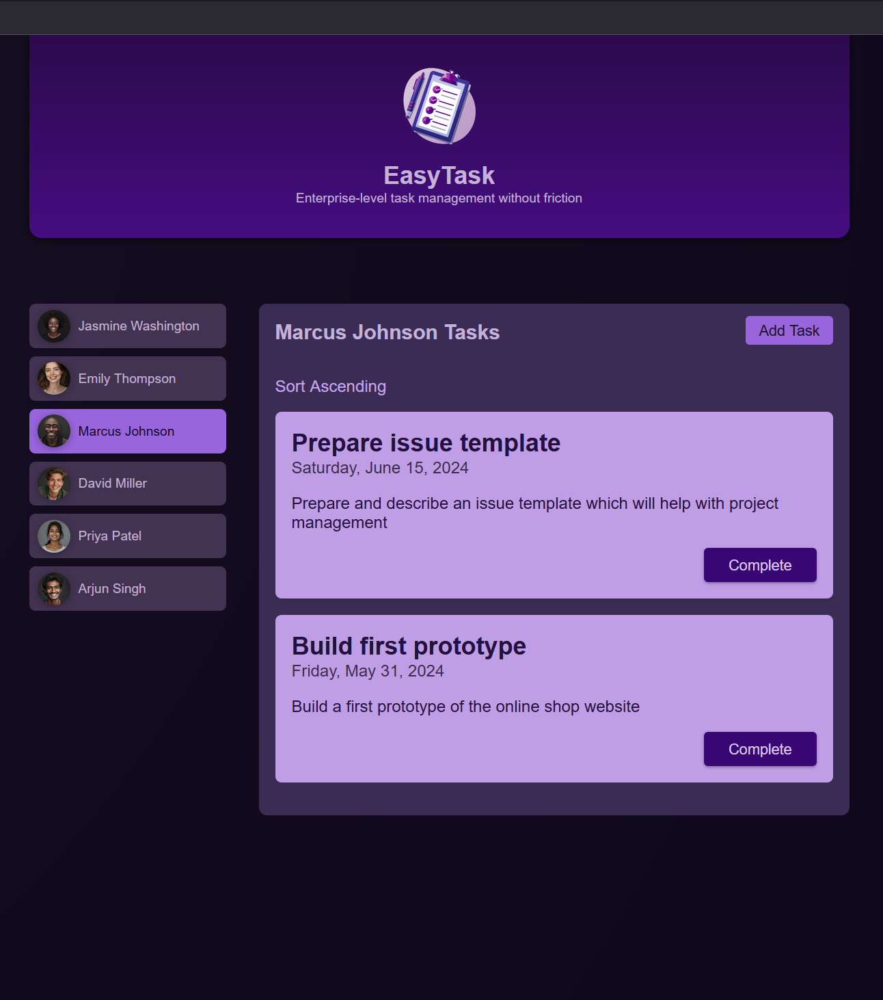

# Genesis
Code is based on "Angular - The Complete Guide" course

[About course](https://www.udemy.com/course/the-complete-guide-to-angular-2/?couponCode=KEEPLEARNING)

# Technologi used
- HTML
- JavaScript
- Angular
- Angular Singnals

# Example

## Easy Task
The application allows the user to add tasks, delete them or mark them as completed.

